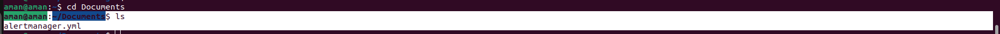

# Linux commands 

## 1. How to make a directory ?

we can make the directory in terminal with the command given below: 
~~~
$ mkdir singhal
~~~

In the above command : 
- 'mkdir' is used for making the directory
- 'singhal' is the name of directory.

(Outout)
~~~
aman@aman:~$ mkdir singhal
aman@aman:~$ ls
 alertmanager   aws            Desktop   Dockerfile   Downloads                                minio      Music      prometheus   registries.conf   snap        text.sh                            Videos
'aman '         awscliv2.zip   docker    Documents    google-chrome-stable_current_amd64.deb   minio.sh   Pictures   Public       singhal           Templates   ubuntu-22.04.3-desktop-amd64.iso
~~~

## 2. Remove a directory 

We can remove a directory with help of command given below: 

~~~
rmdir singhal
~~~

In the above command:
- 'rmdir' is used for remove directory.
- 'singhal' is the name of directory.

(Output)
~~~
aman@aman:~$ rmdir singhal
aman@aman:~$ ls
 alertmanager   aws            Desktop   Dockerfile   Downloads                                minio      Music      prometheus   registries.conf   Templates   ubuntu-22.04.3-desktop-amd64.iso
'aman '         awscliv2.zip   docker    Documents    google-chrome-stable_current_amd64.deb   minio.sh   Pictures   Public       snap              text.sh     Videos
~~~

As we can see in the above image that there is no directory with the name 'singhal'.

## 3. Make a copy of a file

To Make a copy of a file follow the command given below 

First we have to know the existing file path which i want to copy in another folder.To know the path of the file we will use the command given below:

~~~
$ sudo apt install plocate 
~~~
(output)
~~~
Reading package lists... Done
Building dependency tree... Done
Reading state information... Done
The following packages were automatically installed and are no longer required:
  apache2-bin apache2-data apache2-utils docutils-common libapr1 libaprutil1 libaprutil1-dbd-sqlite3 libaprutil1-ldap python3-botocore python3-docutils python3-jmespath python3-pyasn1 python3-pygments
  python3-roman python3-rsa python3-s3transfer
Use 'sudo apt autoremove' to remove them.
The following NEW packages will be installed:
  plocate
0 upgraded, 1 newly installed, 0 to remove and 10 not upgraded.
Need to get 129 kB of archives.
After this operation, 512 kB of additional disk space will be used.
Get:1 http://in.archive.ubuntu.com/ubuntu jammy/main amd64 plocate amd64 1.1.15-1ubuntu2 [129 kB]
Fetched 129 kB in 1s (115 kB/s)   
Selecting previously unselected package plocate.
(Reading database ... 211148 files and directories currently installed.)
Preparing to unpack .../plocate_1.1.15-1ubuntu2_amd64.deb ...
Unpacking plocate (1.1.15-1ubuntu2) ...
Setting up plocate (1.1.15-1ubuntu2) ...
update-alternatives: using /usr/bin/plocate to provide /usr/bin/locate (locate) in auto mode
Adding group `plocate' (GID 141) ...
Done.
Initializing plocate database; this may take some time... done
Created symlink /etc/systemd/system/timers.target.wants/plocate-updatedb.timer → /lib/systemd/system/plocate-updatedb.timer.
Processing triggers for man-db (2.10.2-1) ...
~~~

In the abbove command:

- 'sudo' is for root prevelge.
- 'apt' is for advance package tool.
- 'install' is to install the package.
- 'plocate' is the package name.

Now well will locate the file with the command:

~~~
$ locate alertmanager.yml
~~~
(output)
~~~
/home/aman/alertmanager/alertmanager.yml
~~~

Now we have the path of the file with the name 'alertmanager.yml'

To copy the file in the other directory use command:

~~~
$ cp /home/aman/alertmanager/alertmanger.yml /home/aman/Documents
~~~

In the above command:
- 'cp' is used for copy the file 
- '/home/aman/alertmanager/alertmanger.yml' is the part of the path file.
- '/home/aman/Documents' this part the path where we want to copy the file. 

now fo to the Document directory with the command:
~~~
cd Documents
~~~

(output)
~~~
aman@aman:~/Documents$ ls
alertmanager.yml
~~~

## 4. Move or rename a file

To rename a file, we will use command :

first we have to go in the directoruy by the cd command.
~~~
$ cd Docuemnts
~~~
In the above command:
- 'cd' is used for change the direcotory.
- 'Documents' is the name of directory.
~~~
$ mv alertmanger.yml alert.yml
~~~
In the above command:
- 'mv' is used for rename the file.
- 'alertmanager.yml' is the name of the existing file.
- 'alert.yml' is the new name of the file.

(output)
~~~
aman@aman:~/Documents$ ls
alert.yml
~~~

Here we can see in the above image that the file name is changed.

Move a file with the help of the command given below:

~~~
$ mv /home/aman/alermanagmanager/alert.yml /home/aman/Documents 
~~~
In the above command:
- 'mv' is used for moving the file.
- '/home/aman/alermanagmanager/alert.yml' is the apth of the file file where it is existing.
- '/home/aman/Documents' is the path where we want to move the file.

Now we will go to the 'Documents' directory with command :

~~~
cd Documents
~~~
In the above command:
- 'cd' is used for change the direcotory.
- 'Documents' is the name of directory.

~~~
aman@aman:~/Documents$ 
~~~

To check that file is moved or not type 'ls' 

(output)

~~~
aman@aman:~/Documents$ ls
alertmanager.yml
~~~

## 5. Create an empty file

To create a empty file use the command below:
 
~~~
$ touch amanfile
~~~

In the Above command :
- 'touch' is to make the file.
- 'amanfile' is the name of file.

To see the file type 'ls' and press enter

~~~
aman@aman:~$ ls 
 alertmanager    amanfile       Desktop      Document    google-chrome-stable_current_amd64.deb   Music        Public            Templates                          Videos
 alertmanager~   aws            docker       Documents   minio                                    Pictures     registries.conf   text.sh
~~~
as we can see that the file is created.

## 6. Remove multiple files with a single command

To remove multiple files with a single command use the command below:

As we can see in the above image that we have 3 files with the name 'aman' 'singhalss' 'kumar'.

Now we will remove thies files with single command:

~~~
$ rm aman singhalss kumar 
~~~
In the above command:
- 'rm' is used for removing the files 
- 'aman singhalss kumar' are names of teh files. 

(output)
~~~
aman@aman:~$ rm aman singhalss kumar
aman@aman:~$ ls 
 alertmanager    amanfile       Desktop      Document    google-chrome-stable_current_amd64.deb   Music        Public            Templates                          Videos
 alertmanager~   aws            docker       Documents   minio                                    Pictures     registries.conf   text.sh
'aman '          awscliv2.zip   Dockerfile   Downloads   minio.sh                                 prometheus   snap              ubuntu-22.04.3-desktop-amd64.iso
~~~

 

As we can see in the above image that the files are removed.

## 7. Remove content from the folder without removing folder

To remove content from the folder without removing folder use the command given below:

As we can se in the above image that we have a file in the Documents directory with name 'alertmanager.yml' we wil remove it from that diretory without going in the directory.

~~~
$ rm /home/aman/Documents/alertmanager.yml
~~~

In the above command :
- 'rm' is used for removing the content.
- '/home/aman/Documents/alertmanager.yml' is the path of the content.

(Output)
~~~
aman@aman:~$ rm /home/aman/Documents/alertmanager.yml
aman@aman:~$ cd Documents
aman@aman:~/Documents$ ls
~~~

As we can see there is nothing in the above image there is no contant in the directory.

## 8. Create multiple folder(a-z) with a single command

To Create multiple folder(a-z) with a single command follow the command given below:
~~~
$ mkdir {A..Z}
~~~

In the above command :
- 'mkdir' is used for making the directories.
- 'A..Z' is used for making all directories from A to Z.

(output)

~~~
aman@aman:~/A-Z$ mkdir {A..Z}
aman@aman:~/A-Z$ ls
A  B  C  D  E  F  G  H  I  J  K  L  M  N  O  P  Q  R  S  T  U  V  W  X  Y  Z
aman@aman:~/A-Z$ 
~~~

As we can see in the above image that all directories are made with the single command.

